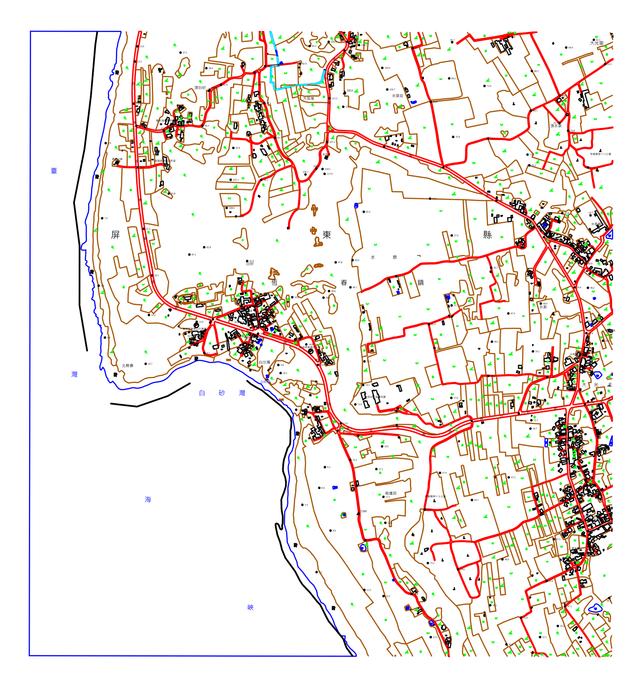

# mydxf2png
將 dxf 轉檔，輸出 png 

 
作者： 
  (2020) Hamza Mohamed Abd Al Hakeem 
  (2021) Feather Mountain (https://3wa.tw) 
License： 
  MIT 
編譯方法： 
<ul>
  <li>1. install miniconda : https://repo.anaconda.com/miniconda/Miniconda3-py39_4.9.2-Windows-x86_64.exe</li>
  <li>2. conda install matplotlib</li>
  <li>3. conda install pyinstaller</li>
  <li>4. conda install ezdxf</li>
  <li>5. conda install wxPython</li>
  <li>6. 執行測試：C:\ProgramData\Miniconda3\python.exe dxf2png.py</li>
  <li>7. 編譯：C:\ProgramData\Miniconda3\scripts\pyinstaller.exe -F dxf2png.py</li>
  <li>8. 成功就會產生 dist\dxf2png.exe</li> 
</ul>
  
使用方法： 
  dxf2png.exe source.dxf output.png 
   
  例如: 
  dxf2png.exe 95164029.dxf 95164029.png 
  dxf2png.exe 95181024.dxf 95181024.png 
 
Reference: 
  https://github.com/Hamza442004/DXF2img 
